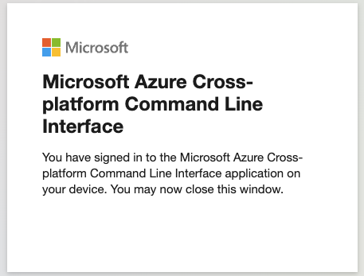

# aws_ad_auth

---
---

### Overview:
---
This repo is used to build a custom docker container that will run on `MacOS` with an M2 processor that will allow you to authenticate from a terminal window to Azure AD.   After authenticating to Azure AD, you will be able to execute AWS CLI commands as a `Federated user` for a short period of time (without the need to create `<AWS Access Keys>` and `<AWS Secret Keys>`.

*  Kudos to Brian Lachance for the shell script and python code used here!

---

### One Time Setup Step:

* These commands are all run from a `Terminal` window.
---

1. Pull this repository to your machine
```
git clone https://github.com/tlepple/aws_ad_auth.git
```

2.  Change to this new directory on your machine
```
cd ./aws_ad_auth
```

3.  Build a local image on your host
```
docker build --no-cache --platform=linux/arm64 -t arm64v8/alpine:aws-ad-auth-img .
```

4.  Create a `Docker Volume` that will persist to hold items created in your container
```
docker volume create awsadauth_vol1
```

5.  Create a new container from the image built above
```
docker compose up -d
```

6.  Connect to this new container:
*  This container does not run like most docker containers, it is operating more like a linux VM.   It will run continously until you shut it down.

```
docker exec -it aws-ad-auth bash
```
7.  Setup a local aws config file with profiles you have access to from Azure AD credentials
```
cd /app/pim

az login
```

*  This will return output similar to this:
```
To sign in, use a web browser to open the page https://microsoft.com/devicelogin and enter the code <your specfic code> to authenticate.
```
  A.  Open a chrome browser on your host and give it the URL `https://microsoft.com/devicelogin`.   
  B.  It will ask you to enter the code from your container `<your specfic code>`.   
  C.  From here you will select your Microsoft AD account.  
  D.  Then click the `Continue` button from the next screen.
  E.  If all is working you should see the follow image.
        


8.  
---
---

